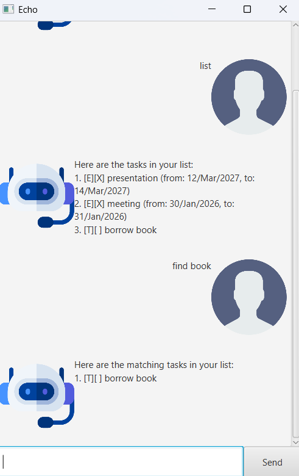

# Echo User Guide



Text-based, intuitive and ~~very~~ lightning fast
> "Best text-based chatbot ever." - Me

<br>

## Exiting Echo
Exiting the chatbot application.
### Usage
```
bye
```

### Example Input
```
bye
```

### Example Output
Application closes.

<br>

## Adding deadlines
Adding tasks that are to be done by a certain date.
### Usage
```
deadline [name/description] /by [date in the format YYYY-MM-dd]
```

### Example Input
```
deadline CS2103 iP /by 2026-02-20
```

### Example Output
```
ADDED: [D][ ] CS2103 iP (by: 20/Feb/2026)
```

<br>

## Adding events
Adding tasks/activities that will be happening during a period of time.
### Usage
```
event [name/description] /from [start date in the format YYYY-MM-dd] /to [end date in the format YYYY-MM-dd]
```

### Example Input
```
event Recess week /from 2026-02-23 /to 2026-02-27
```

### Example Output
```
ADDED: [E][ ] Recess week (from: 23/Feb/2026, to: 27/Feb/2026)
```

<br>

## Adding todos
Adding ad-hoc tasks to be completed with no deadlines.
### Usage
```
todo [name/description]
```

### Example Input
```
todo Submit CS2103 iP
```

### Example Output
```
ADDED: [T][ ] Submit CS2103 iP
```

<br>

## Deleting tasks
Deleting a deadline/event/todo that was previously added.
### Usage
```
delete [task number as shown by the list command]
```

### Example Input
```
delete 1
```

### Example Output
```
REMOVED: [D][ ] CS2103 iP (by: 20/Feb/2026)
```

<br>

## Finding a task
Finding a task by keywords in the name/description.
### Usage
```
find [keywords separated by a space, not case-sensitive]
```

### Example Input
```
find cs2103 recess
```

### Example Output
```
Here are the matching tasks in your list:
1. [E][ ] Recess week (from: 23/Feb/2026, to: 27/Feb/2026)
2. [T][ ] Submit CS2103 iP
```

<br>

## Listing all tasks
Listing all saved tasks.
### Usage
```
list
```

### Example Input
```
list
```

### Example Output
```
Here are the tasks in your list:
1. [E][ ] Recess week (from: 23/Feb/2026, to: 27/Feb/2026)
2. [T][ ] Submit CS2103 iP
```

<br>

## Marking/Unmarking a task
Mark or unmark a task's done status.
### Usage
```
mark [task number as shown by the list command]
unmark [task number as shown by the list command]
```

### Example Input
```
mark 1
unmark 1
```

### Example Output
```
MARKED: [E][X] Recess week (from: 23/Feb/2026, to: 27/Feb/2026)
UNMARKED: [E][ ] Recess week (from: 23/Feb/2026, to: 27/Feb/2026)
```

## Credits
### Profile Images/Avatars: [Flaticon](https://www.flaticon.com/)